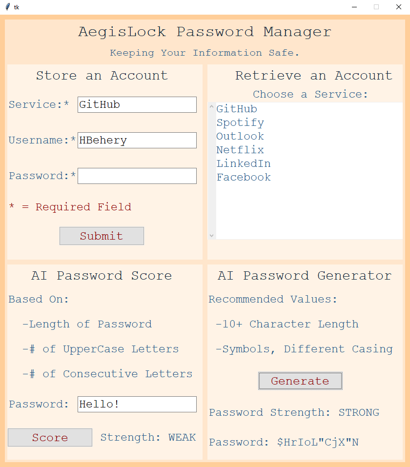

## AegisLock: an AI-powered Account and Password Manager

An all-in-one application created in Python tkinter. Its features include:

- Storing Account Information
- Retrieving Account Information
- (AI Feature) Testing the Strength of a Password
- (AI Feature) Generating an Ideal Password

> **_NOTE:_** This project uses a fine-tuned version of Microsoft's CodeBERT-base model, and requires a version of numpy below 2.

## Next Steps:

- Code a cross-platform frontend
- Build a Chrome extension for the application
